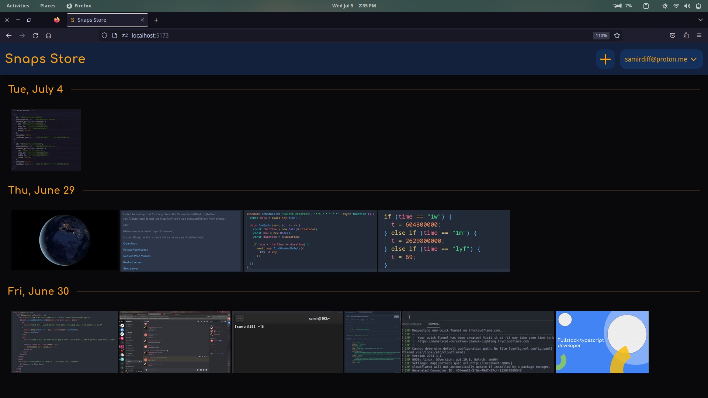

# Welcome to Snaps Store! 📸



Snaps Store is the ultimate gallery app that combines creativity, simplicity, and elegance. This repository hosts the codebase for Snaps Store, a web application designed as a learning project to showcase stunning photography with a seamless user interface. We invite you to contribute and help us improve this project!

## Features ✨

- Secure authentication with Google OAuth2 integration 🔒
- File storage and management using Supabase's file bucket 💾
- Built with SvelteKit, TypeScript, Supabase, and Tailwind CSS for a modern development experience 🚀

## Installation ⚙️

To set up Snaps Store locally, follow these steps:

1. Clone this repository to your local machine using the following command:

```
git clone https://github.com/samocodes/snaps-store.git
```

2. Install the required dependencies by running the following command:

```
cd snaps-store
npm install
```

3. Go to https://supabase.com and create a new project

4. Copy "Project URL" and "API Key" under Project API and rename `.env.example` to `.env` at the root of the project and paste it in `.env`

5. Create bucket in your project and edit `BUCKET_NAME` in file `src/lib/constants.ts`

6. Start the development server:

```
npm run dev
```

5. Open your browser and navigate to `http://localhost:5147` to access Snaps Store locally.

## Todo 📝

- Make it responsive for all screens 📱💻🖥️
- Implement face detector 🔧🚀
- Fix some functionality

## Contributing 🤝

We welcome contributions from the open-source community to enhance the Snaps Store project. If you would like to contribute, please follow these guidelines:

1. Fork the repository and create your branch from `main`.
2. Make your desired changes and improvements.
3. Ensure that your code adheres to the existing code style and conventions.
4. Write clear and concise commit messages.
5. Push your changes to your forked repository.
6. Open a pull request, describing the changes you have made and why they should be merged.

## License 📄

Snaps Store is released under the [MIT License](https://opensource.org/licenses/MIT). Feel free to modify and distribute the application according to the terms of this license.

## Contact 📧

If you have any questions, suggestions, or feedback, please don't hesitate to reach out. You can contact me at `samirdiff@proton.me`.
